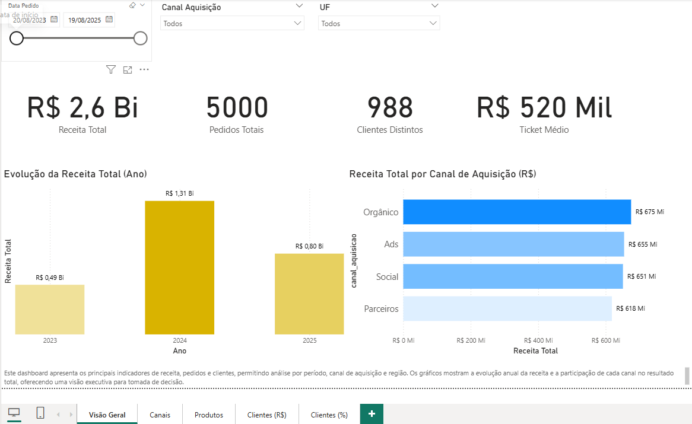
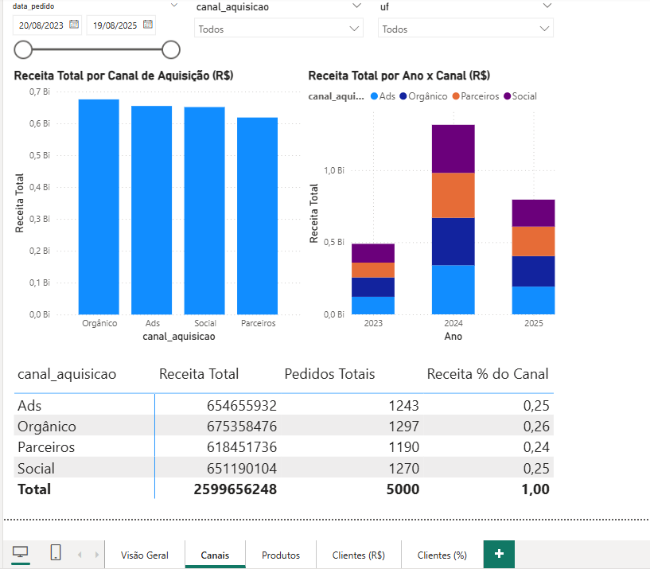
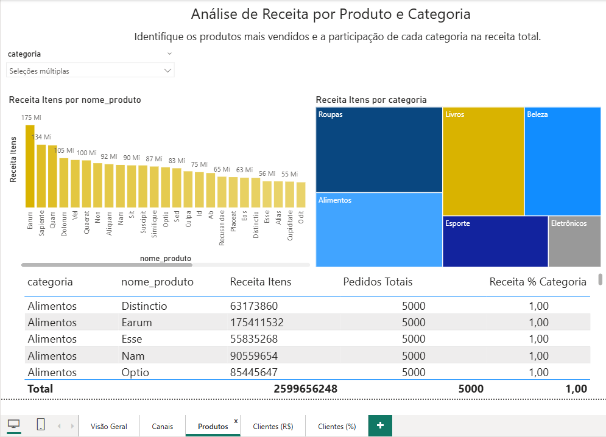
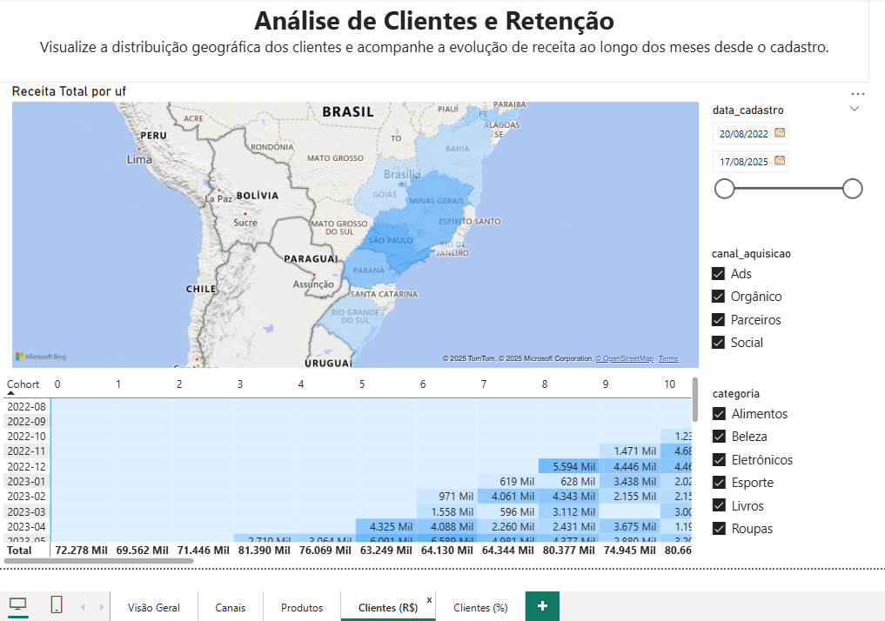

# 📊 Power BI Dashboard – Revenue & Retention Analysis  

An interactive **Power BI dashboard** designed to analyze **revenue performance, sales channels, product categories, and customer retention**.  
This project demonstrates my skills in **data modeling, DAX, and interactive dashboard design** using Power BI.  

---

## 🎯 Project Objectives  
- Provide a **clear executive view** of revenue, orders, and key KPIs.  
- Enable users to explore **channel performance, top-selling products, and category contributions**.  
- Track **customer retention** using cohort analysis to monitor engagement over time.  

---

## 🖼️ Dashboard Overview  

### 1️⃣ Executive Overview  
  
**KPIs:** Total Revenue, Total Orders, Distinct Customers, and Average Ticket.  
**Visuals:** Yearly Revenue (Column Chart), Revenue by Channel (Bar Chart).  
**Filters:** Date, Acquisition Channel, and State (UF).  
**Goal:** Provide decision-makers with a high-level snapshot of business performance.  

---

### 2️⃣ Channel Analysis  
  
**Visuals:** Revenue by Channel (Bar Chart), Revenue by Channel over Time (Stacked Column Chart).  
**Table:** Channel share, total orders, and % of contribution.  
**Goal:** Quickly compare performance of marketing channels (Ads, Organic, Social, Partners).  

---

### 3️⃣ Product Performance  
  
**Visuals:** Top Products by Revenue (Column Chart), Revenue by Category (Treemap).  
**Table:** Revenue and total orders per product and category.  
**Goal:** Identify best-selling products and categories, driving the highest revenue share.  

---

### 4️⃣ Customer Retention  
  
**Visuals:** Cohort Heatmap showing monthly revenue contribution by cohorts.  
**Goal:** Track customer engagement and measure retention across time since acquisition.  

---

## 🛠️ Technical Solution  

### 🧩 Data Model  
- Star schema with: `orders`, `order_items`, `customers`, `channels`, and `products` tables.  
- Relationships established by primary/foreign keys (customer_id, order_id).  

### 📐 DAX Measures  
- **Total Revenue** = `SUM(order_items[price])`  
- **Average Ticket** = `DIVIDE([Total Revenue], [Total Orders])`  

### 🖌️ Visuals & Interactivity  
- KPI Cards, Clustered Column Charts, Treemaps, and Bar Charts.  
- Slicers for date, channel, state (UF), and category.  

---

## 📂 Project Files  
- [Executive_PowerBI_Dashboard_Business_Insights.pbix](./Executive_PowerBI_Dashboard_Business_Insights.pbix)  
- [Project Documentation (PDF)](./Executive_PowerBI_Dashboard_Business_Insights_V1.pdf)  

---

## 🚀 How to Use  
1. Download the `.pbix` file and open it in **Power BI Desktop**.  
2. Explore the dashboard using slicers for date, channel, and product category.  
3. Review the PDF for context on the business problem, solution design, and technical approach.  

---

## 💡 Key Skills Demonstrated  
- Microsoft Power BI Development  
- Data Visualization & Storytelling  
- DAX & Data Modeling  
- Business Intelligence & Analytics  
- KPI Tracking & Cohort Analysis  
